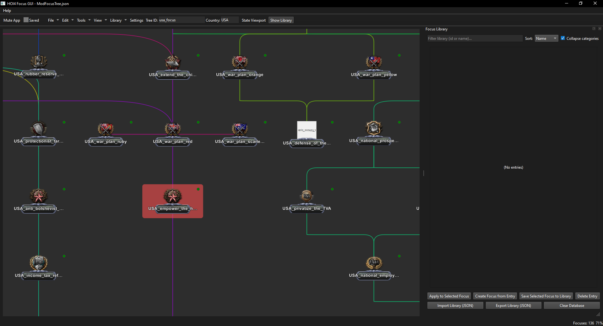
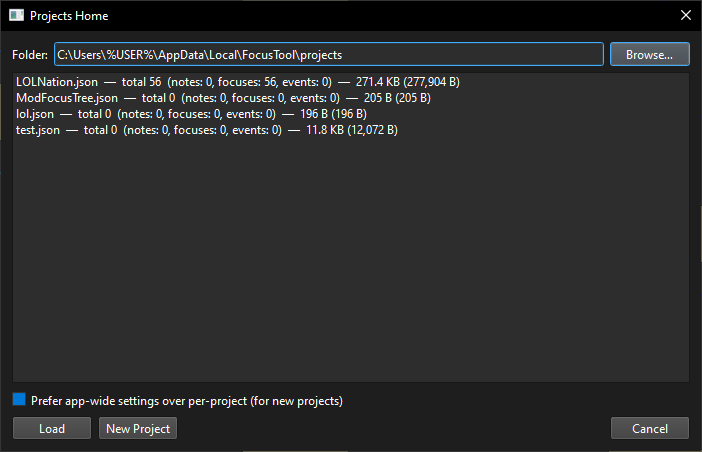
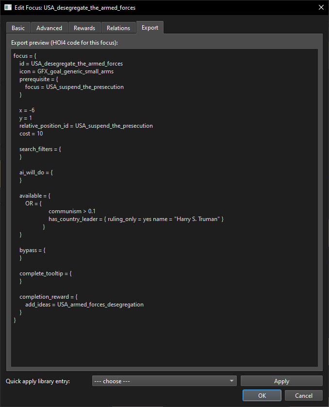
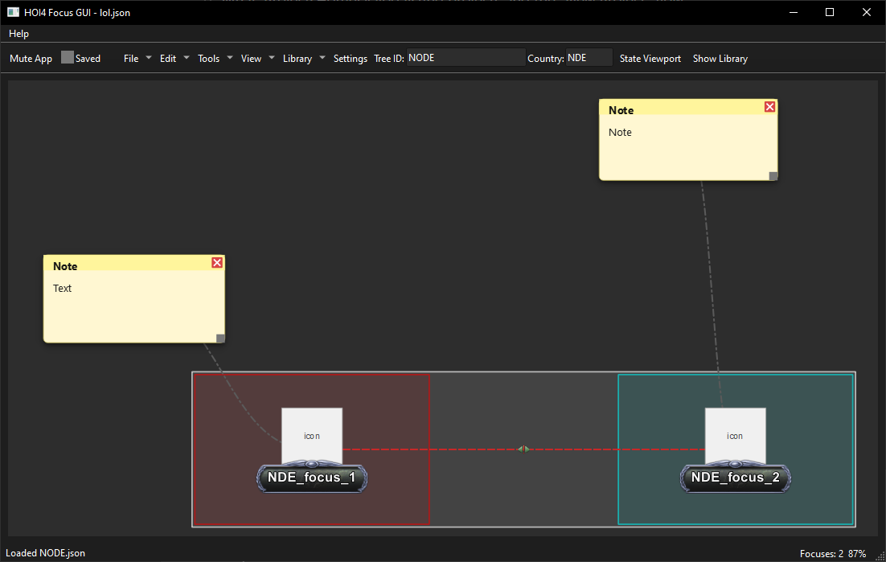
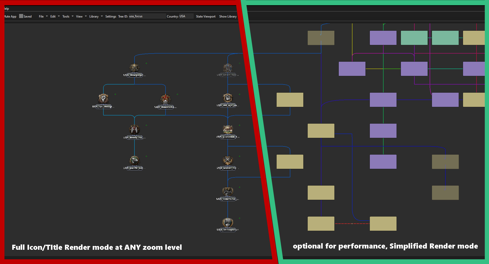
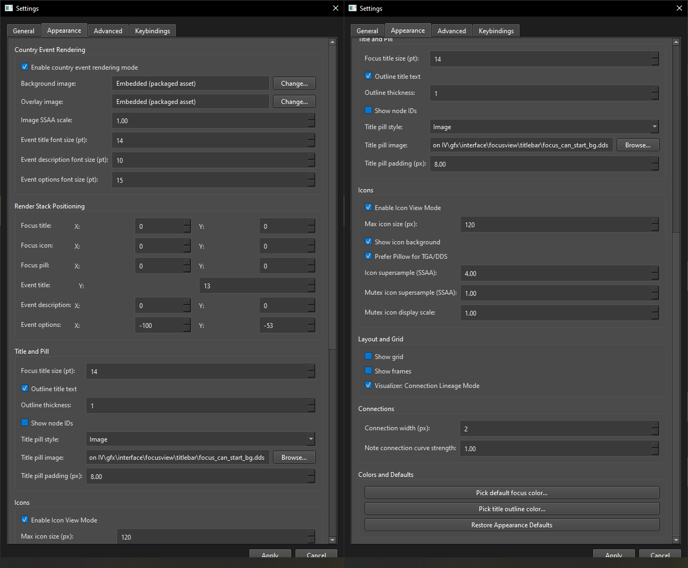
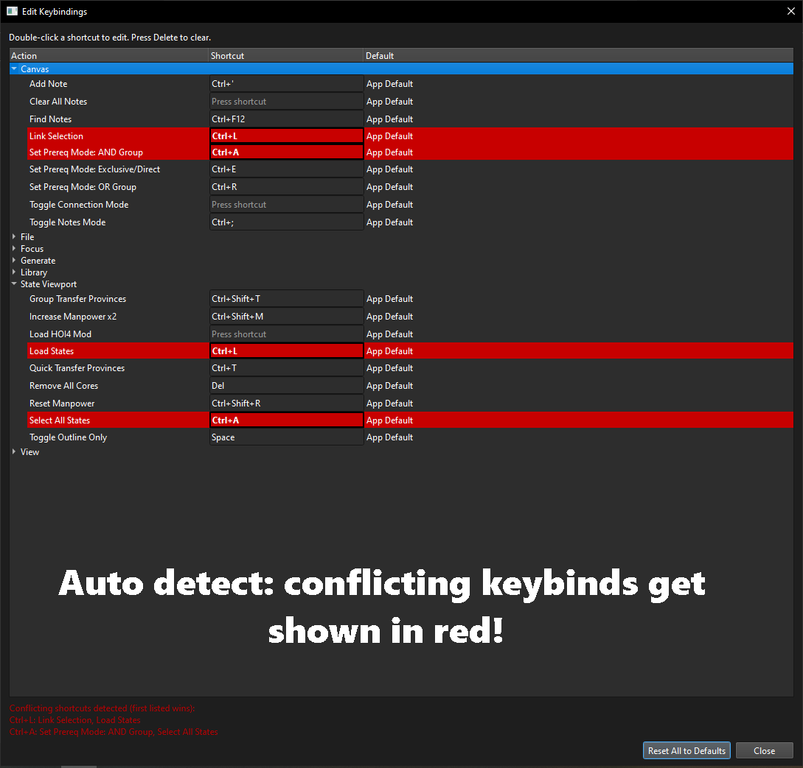
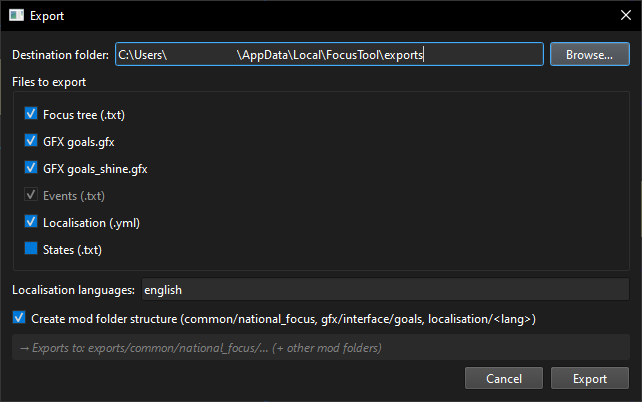

> **Original Reddit Post** - https://www.reddit.com/r/hoi4modding/comments/1nmkbg5/focus_tree_editor_tool

**Python-based Hearts of Iron IV mod GUI, primarily built for generating random focus trees.**

---

# FEATURES in 1.0.9

## Main Canvas (Node Editor Window)

## New Project (Project Manager Window)

## Generate Focus Tree (Tool)

### Focus Editor Panel (Window)

### Focus Frames, Notes and Mutex Icons (Optional, Tool, Appearance)

## Multi Rendering Modes (Customizable)

# Canvas Appearance and Performance (Settings)

## Conflicting Keybinds Detection & Display (Configurable)

# Export Mod to HOI4 (Tool)

---

## ⚠️ USER WARNING (Norton AV & Windows Defender)

- This will likely be flagged as a virus -- mainly because it is an .exe file made with the use of PyInstaller via AutoPyToExe. Also, I cannot afford to certify this app. 
- If you still want to use it: on the right side of the options for it, there's "Restore", and "Add Exclusion and Restore", click the second option. This should allow you to use the app.

---

## ⚠️ **PLEASE READ!**

1. **Save frequently.** There *IS* now an auto-save feature. Backup your files in another folder when exporting to HOI4 code. Auto-save is NOT a replacement for backups and manual saving.
2. **Toolkit is still in very early development.** Paradox are prone to breaking changes in modding, so, if you notice something out of the ordinary, feel free to stop in to my discord and let me know what's going on!

---

## Peace of Mind

- **All data is stored locally, on YOUR PC, forever** (until deleted/removed/transferred).
- **No server setup, no installer** (also means no uninstaller, everything is held here: `AppData\Local\FocusTool` -- EXCEPT the .exe itself).

---

## Technical Details

This has been removed in update 1.0.9 due to needing a major re-examination of all libraries used to ensure total accuracy for users.
