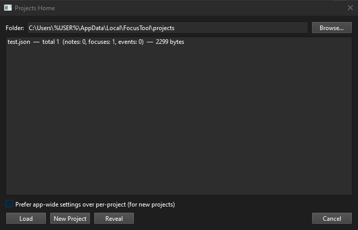
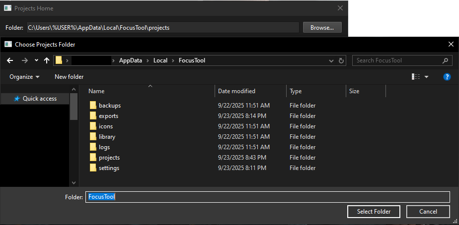
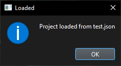
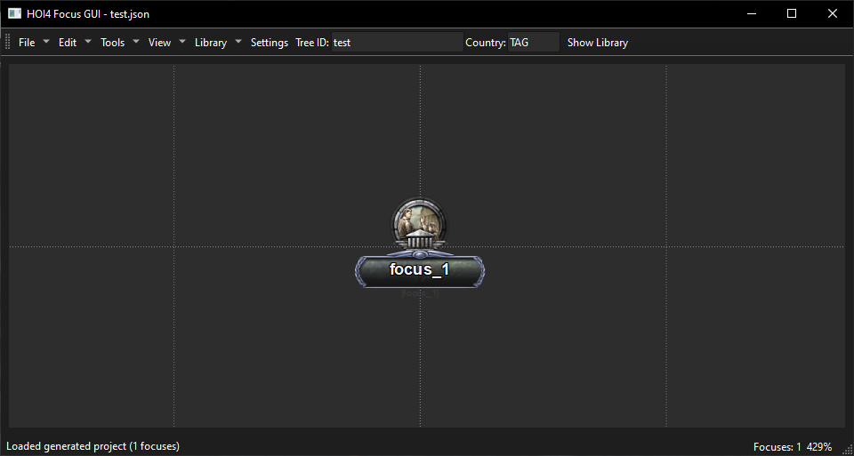
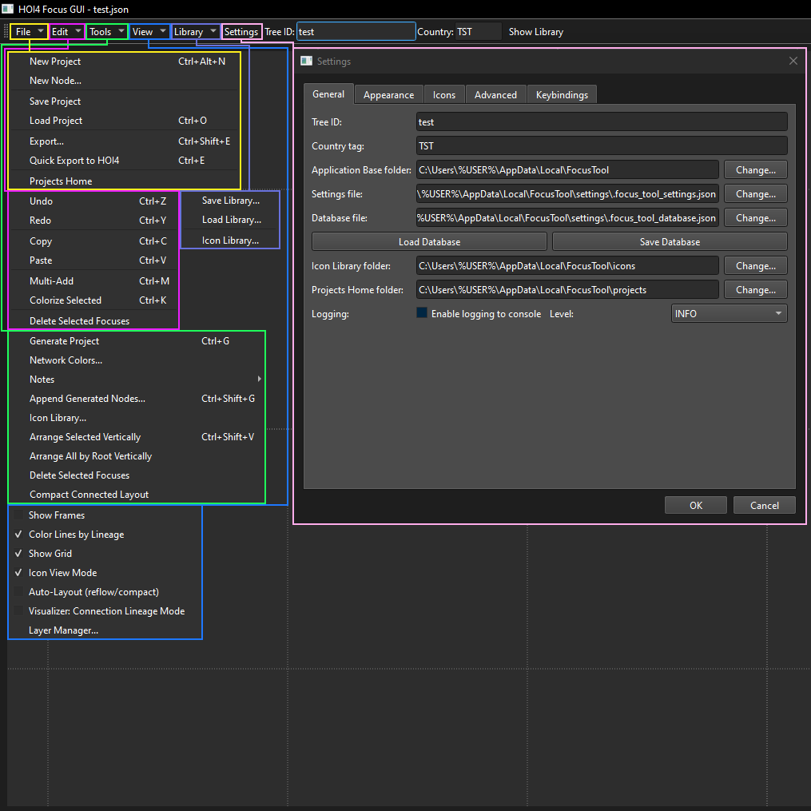

> **DISCORD LINK** - Prophet's Preposterous Projects: https://discord.gg/RuaR7CBy7Z

> **Original Reddit Post** - https://www.reddit.com/r/hoi4modding/comments/1nmkbg5/focus_tree_editor_tool

**Python-based Hearts of Iron IV mod GUI, primarily built for generating random focus trees.**

---

## FEATURES*
**may change at ANY time

### Project Manager

### Confirmation Popups

### Editor Canvas

### Toolbar

---

## ⚠️ USER WARNING (Norton AV)

- This will likely be flagged as a virus -- mainly because it is an .exe file made with the use of PyInstaller via AutoPyToExe. Also, I cannot afford to certify this app. 
- If you still want to use it: on the right side of the options for it, there's "Restore", and "Add Exclusion and Restore", click the second option. This should allow you to use the app.

---

## ⚠️ **PLEASE READ!**

1. **Save frequently.** There is no auto-save feature (so far). Backup your files in another folder when exporting to HOI4 code.
2. **Toolkit is still in very early development.** Paradox are prone to breaking changes in modding, so, if you notice something out of the ordinary, feel free to stop in to my discord and let me know what's going on!

---

## Peace of Mind

- **All data is stored locally, on YOUR PC, forever** (until deleted/removed/transferred).
- **No server setup, no installer** (also means no uninstaller, everything is held here: `AppData\Local\FocusTool` -- EXCEPT the .exe itself).

---

## Technical Details

For technically-inclined users: a list of Python Packages which were used in the creation of the application for your review.

### Standard Library Packages:
- `os`, `re`, `sys`, `time`, `json`, `uuid`, `typing`, `logging`, `datetime`, `threading`, `subprocess`

### Additional Packages:
- `PIL`, `PyQt6.QtCore`, `PyQt6.QtGui`, `PyQt6.QtWidgets`